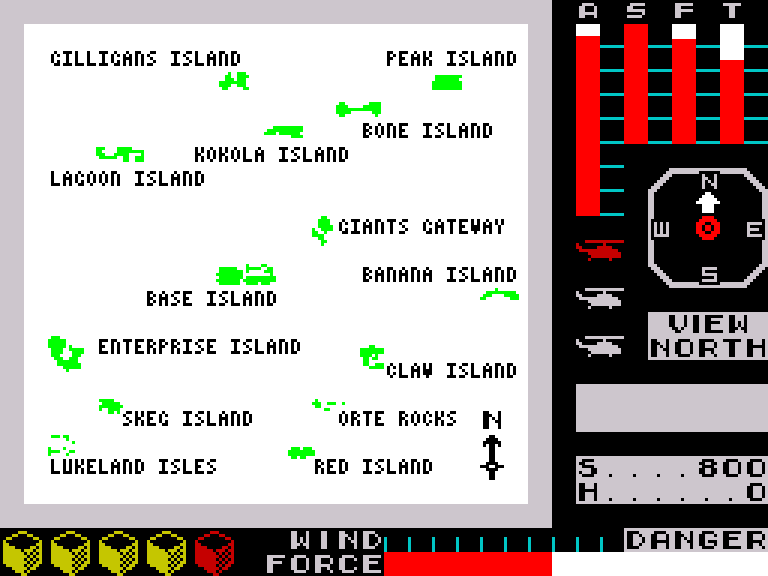
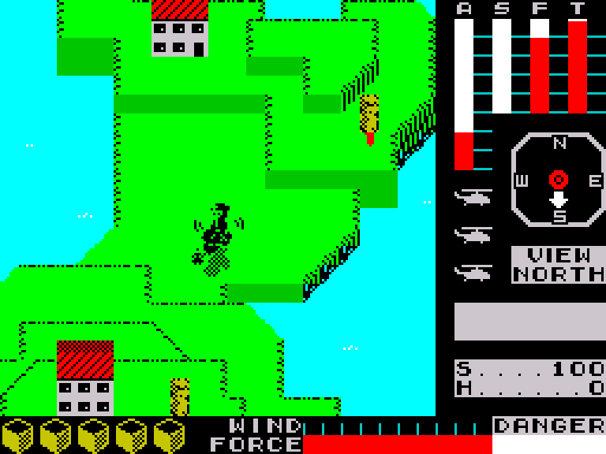
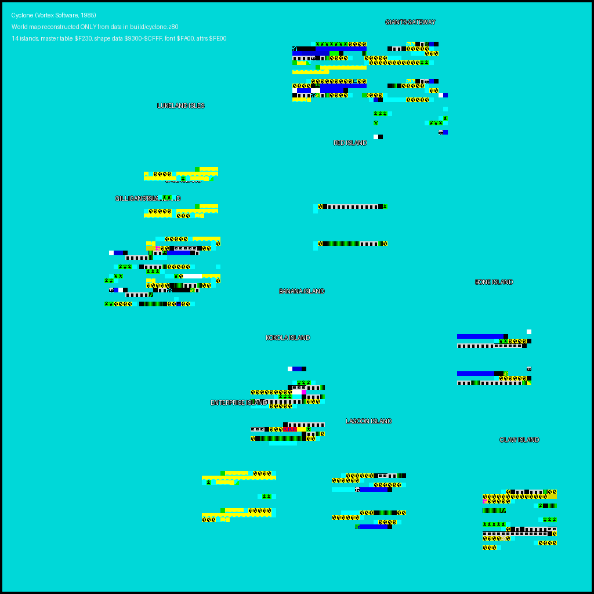
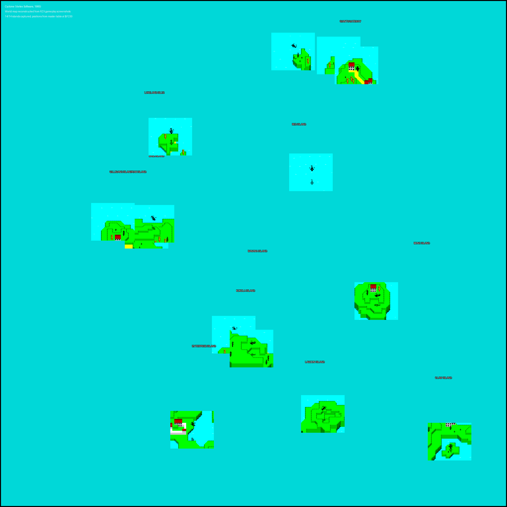

# The 14 islands of Cyclone — master table at `$F230`

Cyclone's entire world is 14 fixed locations on a single 256×256 archipelago.
Missions / levels don't change the geography — only the objectives change.



*Cyclone's in-game navigation map — frame 20,000 of `cyclone.rzx`,
rendered with `sna2img.py`. All 14 islands are visible with their
actual names and layout.*



*Isometric flight view — frame 3,000 of the same recording. Helicopter
mid-flight over an island with buildings, palm trees, coastline and the
instrument panel on the right (altitude, speed, fuel, temperature;
compass; view direction; score; damage indicator; wind/force gauge).*

Both images are regenerated by `make worldmap` from the shipped RZX,
via `rzxplay.py --stop N` to reach the right frame plus `sna2img.py` to
render the screen.

## Full archipelago reconstruction

Two independent reconstructions — they show the same islands in the
same places, but reach the result two different ways.

### 1. From only the tape data (no RZX)



*Reconstructed purely from `build/cyclone.z80`, the snapshot built by
`tap2sna.py` directly from the original tape.*
`tools/render_world_fromdata.py` reads the 14-island master table at
`$F230`, walks each island's `16×16` tile map at its `+$0A/+$0B` base
pointer, resolves each tile against the font at `$FA00` and the colour
table at `$FE00`, and composites every island at its decoded world
centre. It does not run the Z80 and does not use the RZX.

If any of the table addresses, field offsets or data-structure sizes
were off, islands would appear in wrong places or as the wrong shape.
They don't — which is the strongest possible confirmation that the
numbers in `cyclone.ctl` describe the real data layout.

### 2. From live RZX gameplay (uses the game's own renderer)



*A higher-fidelity reconstruction using the game's own isometric
renderer.* `tools/build_full_map.py` scans the shipped RZX at
1500-frame intervals, reads the helicopter's world coordinates from
(`$7500`, `$7502`) at each sample, picks the frame where the helicopter
is best-centred over each island (bounds from `$F230`), crops the
playfield, masks out the sea, and composites all 14 islands onto a
2048×2048 canvas.

Every step uses data or code we've identified from the original:

- The 14 island **world positions** come from the master table at
  `$F230` (fields `+$02..+$05`).
- The **helicopter position variables** are `($7500)` and `($7502)`,
  identified by cross-referencing reads across `$76D2`, `$7777`, `$77B7`.
- The **visual rendering** is done by Cyclone's own engine while
  `rzxplay.py` replays the RZX — we just capture the resulting display
  file via `sna2img.py`.
- The **flight-vs-map discriminator** uses attribute paper values to
  tell 3-D flight frames (cyan paper) from navigation-map frames
  (white paper) — the attribute layout is decoded in `cyclone.ctl`.

Both reconstructions place every island at the same world location;
both match published reference maps (e.g. Pavero, 2004).

The master table lives at `$F230` in the post-load snapshot. Each record is
20 bytes (`$14`); there are 14 records followed by an `$FF` end-marker at
`$F348`. The name of each record is looked up in the compressed stream at
`$6A50` (see `cyclone.ctl` for the decoder).

## Record layout

| Offset | Meaning |
| ------:| ------- |
| `+$00` | Object type byte (`$00` / `$01` / `$02`) |
| `+$01` | Sub-type (`$00` / `$01` / `$02`) |
| `+$02` | `x_min` — world X lower bound |
| `+$03` | `x_max` — world X upper bound |
| `+$04` | `y_min` — world Y lower bound |
| `+$05` | `y_max` — world Y upper bound |
| `+$06` | `data_x_min` — shape-data X lower bound (= `x_min + 22`). Subtracted from the helicopter X by the flight engine: `HL = shape_base + … + (helX - IX+$06)`. |
| `+$07` | `data_x_max` — shape-data X upper bound (= `x_max - 22`). The 22-cell gap on each side is the half-width of the engine's 23-column visible play area: world bounds are wider than the island so the helicopter can fly past it before the next island scrolls in. |
| `+$08..+$09` | `y_origin` — flight engine's Y origin (= `y_min + 28`, equal to `y_max - 28` when the island is exactly 57 rows tall). Subtracted from helicopter Y. The two bytes are usually equal; a few records (GIANTS GATEWAY, ENTERPRISE ISLAND, …) use a small spread to bias the projector. |
| `+$0A..+$0B` | Runtime shape-work-buffer pointer (zero in a pre-init snapshot) |
| `+$0C..+$0D` | Display-file address for the projected shape |
| `+$0E..+$0F` | Extra work field |
| `+$10..+$11` | Unused by the name walker |
| `+$12` | Attribute-file high byte |
| `+$13` | `$00` — record terminator |

## The 14 islands

The `data x` column below is the inner shape-data extent (`+$06`/`+$07` =
`x_min+22` / `x_max-22`); the wider `x range` (`+$02`/`+$03`) is where the
helicopter can fly. Earlier docs labelled `+$06`/`+$07` as `z_min`/`z_max`,
which mistook a tight X bound for an altitude.

|  # | Address | Name              |   x range |   y range |    data x |
|---:|:--------|:------------------|----------:|----------:|----------:|
|  0 | `$F230` | BANANA ISLAND     |  92 – 168 | 128 – 184 | 114 – 146 |
|  1 | `$F244` | FORTE ROCKS       | 136 – 211 |   0 –  57 | 158 – 189 |
|  2 | `$F258` | KOKOLA ISLAND     |  87 – 161 | 148 – 204 | 109 – 139 |
|  3 | `$F26C` | LAGOON ISLAND     | 116 – 203 | 184 – 240 | 138 – 181 |
|  4 | `$F280` | PEAK ISLAND       |  40 – 101 |  88 – 144 |  62 –  79 |
|  5 | `$F294` | BASE ISLAND       |  28 – 130 |  80 – 136 |  50 – 108 |
|  6 | `$F2A8` | GILLIGANS ISLAND  |  28 –  94 |  88 – 145 |  50 –  72 |
|  7 | `$F2BC` | RED ISLAND        | 120 – 182 |  64 – 120 | 142 – 160 |
|  8 | `$F2D0` | SKEG ISLAND       | 112 – 173 |   0 –  56 | 134 – 151 |
|  9 | `$F2E4` | BONE ISLAND       | 172 – 255 | 124 – 180 | 194 – 233 |
| 10 | `$F2F8` | GIANTS GATEWAY    | 152 – 203 |  12 –  80 | 174 – 181 |
| 11 | `$F30C` | CLAW ISLAND       | 196 – 253 | 192 – 254 | 218 – 231 |
| 12 | `$F320` | LUKELAND ISLES    |  48 – 109 |  48 – 108 |  70 –  87 |
| 13 | `$F334` | ENTERPRISE ISLAND |  68 – 139 | 176 – 251 |  90 – 117 |

## ASCII archipelago (X: 0-255, Y: 0-255, top-down)

```
+----------------------------------------------------------------+
|                                                                |
|                                                                |
|                                   S       F                    |
|                                                                |
|                                            G                   |
|                                                                |
|                                                                |
|                   L                                            |
|                                     R                          |
|                                                                |
|               G P B                                            |
|                                                                |
|                                                                |
|                                                                |
|                                B                    B          |
|                                                                |
|                               K                                |
|                                                                |
|                                                                |
|                         E             L                        |
|                                                        C       |
|                                                                |
|                                                                |
|                                                                |
+----------------------------------------------------------------+
```

(Letters are each island's first letter. Where two islands share an initial,
the legend in `cyclone.ctl` disambiguates.)

## Island shape data (post-init)

The `+$0A/+$0B` base pointers target `$9300-$CFFF`, which is **empty in the
pre-load snapshot** but **fully populated** once the SpeedLock loader has
finished. `make midgame` captures a post-init snapshot
(`build/cyclone-endgame.z80`) by replaying the RZX to its end; the shapes
below are extracted from that snapshot.

Each island occupies a **256-byte, 16×16 tile-index map**. Non-zero bytes
are indices into the 8×8-pixel glyph font at `$FA00` (the same font used
by the tile renderer at `#R$762C`). Zero bytes render as "open sea".

Several islands share a page by packing their non-zero tiles at disjoint
offsets:

- `$9300` holds BANANA, GILLIGANS (`$9354`) and GIANTS GATEWAY (`$9337`).
- `$9D00` holds FORTE ROCKS and RED ISLAND (`$9FD8`).
- `$A900` holds KOKOLA and SKEG (`$ADD8`).
- `$B800` holds BONE (`$B843`).
- `$C600` holds LUKELAND (`$C628`) and ENTERPRISE (`$C64F`).

Within each island's 256-byte block, the shape is typically stored as
**two views** — rows 0-7 and rows 8-15 — that differ subtly, likely for
the helicopter's approach direction.
## Island tile-map shapes

Each island's visual is stored as a 16×16 array of tile indices at its
shape base address (`+$0A/+$0B` in the master record). Non-zero bytes
are tile indices into the 8×8-pixel glyph font at `$FA00` (the same
font used by #R$762C). Zero bytes are "open sea".

Many islands pack two views (e.g. normal + inverted) into rows 0-7 and
rows 8-15 of the same 256-byte block — probably used for the scanline
flip as the helicopter passes over.

Legend: `.` sea  `:` fill  `=` horizontal edge  `#` corner/edge
`o` numeric edge tile  `^` island cap  `*` detail  `+` other.

### BANANA ISLAND
- master record: `$F230`
- shape base: `$9300` (256-byte tile map)
- world bounds: x 92-168, y 128-184

```
   . . . . . . . . . . . . . . . .
   . . . . . . . . . . . . . . . .
   . . . . . . . . . . . . . . . .
   . . . . . . . . . . . . . . . .
   . . . . . . . . . . . . . . . .
   . . . . . . . . . . . . . . . .
   . . . . . . . . . . . . . . . .
   . . . . . . . . . . . . . . . .
   . . . . . . . . . . . . . . . .
   . . . . . * ^ ^ ^ . . . . . . .
   . . . . . . . . . . . . . . . .
   . . . . . . . . . . . . . . . .
   . . . . . . + o o o o . . . . .
   . . . . . . . . . . . . . . . .
   . . . . . + o o . . . . . . . .
   . . o o o o o . . . . . . . . .
```

### FORTE ROCKS
- master record: `$F244`
- shape base: `$9D00` (256-byte tile map)
- world bounds: x 136-211, y 0-57

```
   . . . . . . . . . . . . . . . .
   . . . . . . . . . . . . . . . .
   . . . . . . . . . . . . . . . .
   . . . . . . . . . + + + = * ^ ^
   . . . . . + = = + : : : : : o .
   . . . . . . . . . . + o o : : :
   : : : : : o o + . . . . . . . .
   o : : + : : : : : : : : o o o .
   . . . . . . . . . . . . . . . .
   . . . . . . . . . . . . . . . .
   . . . . . . . . . . . . . . . .
   . . . . . . . . . + + + = * ^ ^
   . . . . . + # + : : : : : o . .
   . . . . . . . . . . . . . o : :
   : : : : o . . . . . . . . . . .
   . o o o o o o o o : : : : : o .
```

### KOKOLA ISLAND
- master record: `$F258`
- shape base: `$A900` (256-byte tile map)
- world bounds: x 87-161, y 148-204

```
   . . . . . . . . . . . . . . . .
   . . . . . . . . . . . . . . . .
   . . . . . . . . . . . . . . . .
   . . . . . . . . + # # # = = = #
   : : : : : : : : : + + + . . . .
   . . . . . . . . . . o + = = = #
   # = + = = = = = = = = # : : : o
   o o o o : : : : : o . . . . . .
   . . . . . . . . . . . . . . . .
   . . . . . . . . . . . . . . . .
   . . . . . . . . . . . . . . . .
   . . . . . . . + = = = = = = = =
   # # # + : : : + + + + + o . . .
   . . . . . . . . . . . + = = # :
   : + # # # # # # # # # + : : o .
   . . . . o o o o o o . . . . . .
```

### LAGOON ISLAND
- master record: `$F26C`
- shape base: `$B600` (256-byte tile map)
- world bounds: x 116-203, y 184-240

```
   . . . . . . . . . . . . . . . .
   . . . . . . . . . . . . . . . .
   . . . . . . . . . . . . . . . .
   . . . . . . . . . . . . . . . .
   . . o : : : : : : + # # = = # +
   : : : : : : o . . . . . . . . .
   . . . . . . . . o : : : : : : o
   o o o o o * ^ ^ ^ ^ ^ ^ ^ . . .
   . . . . . . . . . . . . . . . .
   . . . . . . . . . . . . . . . .
   . . . . . . . . . . . . . . . .
   . . . . . . . . . . . . . . . .
   . . + o o o : : : + # # # + : :
   : : : : : : o . . . . . . . . .
   . . . . . . . . . o : : : : o .
   . . . . . * ^ ^ ^ ^ ^ ^ ^ . . .
```

### PEAK ISLAND
- master record: `$F280`
- shape base: `$C300` (256-byte tile map)
- world bounds: x 40-101, y 88-144

```
   . . . . . . . . . . . . . . . .
   . . . . . . . . . . . . . . . .
   . . . . . . . . . . . . . . . .
   . . . . . . . . . . . . . . . .
   . . . . . + = = * ^ ^ ^ ^ ^ ^ =
   = = = = = # o o o . . . . . . .
   . . . . . . . . . . . . . . . .
   . . . + = = = = # : : : : : o .
   . . . . . . . . . . . . . . . .
   . . . . . . . . . . . . . . . .
   . . . . . . . . . . . . . . . .
   . . . . . . . . . . . . . . . .
   . . . . . . + = = * * * * * * =
   = = = = = # . . . . . . . . . .
   . . . . . . . . . . . . . . . .
   . . . + # # # # + : : + : : o .
```

### BASE ISLAND
- master record: `$F294`
- shape base: `$CF80` (256-byte tile map)
- world bounds: x 28-130, y 80-136

```
   . . . . . . . . . . . . . . . .
   . . . . . . . . . . . . . . . .
   . . . . . . . . . . . . . . . .
   . . . . . . . . . . . . . . . .
   . . . . . . . . . . . . . . . .
   . . + o : : : : : o + + + + + +
   + + . . . . . . . . . . . . o :
   * * + : : + # # # # # + : : o .
   . . . . . . . . . . . . . . . .
   . . . . . . . . . . . . . . . .
   . . . . . . . . . . . . . . . .
   . . . . . . . . . . . . . . . o
   o o o o . . . . . . . . . . . .
   . . . . o : : : + + + + + + + +
   + + . . . . . . . . . . . . o :
   : : : : : + # # = = = # : : o .
```

### GILLIGANS ISLAND
- master record: `$F2A8`
- shape base: `$9354` (256-byte tile map)
- world bounds: x 28-94, y 88-145

```
   . . . . . . . . . . . . . . . .
   . . . . . . . . . . . . . . . .
   . . . . . . . . . . . . . . . .
   . . . . . . . . . . . . . . . .
   . * ^ ^ ^ . . . . . . . . . . .
   . . . . . . . . . . . . . . . .
   . . . . . . . . . . . . . . . .
   . . + o o o o . . . . . . . . .
   . . . . . . . . . . . . . . . .
   . + o o . . . . . . . . . . o o
   o o o . . . . . . . . . . . . .
   . . . . . . . . . . . . . . . .
   . * ^ + ^ . . . . . . . . . . .
   . . . . . . . . . . . . . . . .
   . . . . . . . . . . . . . . . o
   o o : : : : o . . . . . . . . .
```

### RED ISLAND
- master record: `$F2BC`
- shape base: `$9FD8` (256-byte tile map)
- world bounds: x 120-182, y 64-120

```
   . . . . . . . . . . . . . . . .
   . . . . . . . . . . . . . . . .
   . . . . . . . . . . . . . . . .
   . . . . . . . . . . . . . . . .
   . . . . . . . . . . . . . . . .
   . . . . . . . . . . . . . . . .
   o : + = = = = = = = = = = = + o
   o . . . . . . . . . . . . . . .
   . . . . . . . . . . . . . . . .
   . . . . . . . . . . . . . . . .
   . . . . . . . . . . . . . . . .
   . . . . . . . . . . . . . . . .
   . . . . . . . . . . . . . . . .
   . . . . . . . . . . . . . . . .
   o : + # # # # # # # = = = + # :
   o . . . . . . . . . . . . . . .
```

### SKEG ISLAND
- master record: `$F2D0`
- shape base: `$ADD8` (256-byte tile map)
- world bounds: x 112-173, y 0-56

```
   . . . . . . . . . . . . . . . .
   . . . . . . . . . . . . . . . .
   . . . . . . . . . . . . . . . .
   . . . . o o o o o o o o : : : :
   * * * * * ^ ^ ^ ^ ^ ^ ^ ^ ^ ^ ^
   ^ ^ ^ ^ ^ ^ ^ ^ + + ^ . . . . +
   = = = = * ^ = # : : : : o . . .
   + + + + . . . . . . . . . . . .
   . . . . . + + + + + + + + + + +
   + + + + + + + + . . . . . . . .
   . . . . . . . . . . . . . . . .
   . . . o : : : : : : : : : + : :
   : : : : + * ^ ^ ^ ^ ^ ^ ^ ^ ^ ^
   + ^ ^ ^ + + ^ ^ ^ ^ ^ ^ . . . .
   + = = = * * = # : : : : o . . +
   + + + + . . . . . . . . . . . .
```

### BONE ISLAND
- master record: `$F2E4`
- shape base: `$B843` (256-byte tile map)
- world bounds: x 172-255, y 124-180

```
   . . . . . . . . . . . . . . . .
   . . . . . . . . . . . . . . . .
   . . . . . . . . . . . . . . . .
   . . . . . . . . . . . . . . . *
   ^ ^ ^ ^ ^ ^ ^ ^ ^ ^ ^ . . . . .
   . . . . . . . . + o o : : : : +
   = = = = = = = = # # # # # # + .
   . . . . . . . . . . . . . . . .
   . . . . . . . . . . . . . . . .
   . . . . . . . . . . . . . . . .
   . . . . . . . . . . . . . . . .
   . . . . . . . . . . . . . . . *
   ^ ^ ^ ^ ^ ^ ^ ^ * * * . . . . .
   . . . . . . . . o : : : : : : +
   = = = # # = = = = = = = = = # +
   . . . . . . . . . . . . . . . .
```

### GIANTS GATEWAY
- master record: `$F2F8`
- shape base: `$9337` (256-byte tile map)
- world bounds: x 152-203, y 12-80

```
   . . . . . . . . . . . . . . . .
   . . . . . . . . . . . . . . . .
   . . . . . . . . . . . . . . . .
   . . . . . . . . . . . . . . . .
   . . . . . . . . . . . . . . . .
   . . . . . . . . . . . . . . * ^
   ^ ^ . . . . . . . . . . . . . .
   . . . . . . . . . . . . . . . .
   . . . . . . . . . . . . . . . +
   o o o o . . . . . . . . . . . .
   . . . . . . . . . . . . . . + o
   o . . . . . . . . . . o o o o o
   . . . . . . . . . . . . . . . .
   . . . . . . . . . . . . . . * ^
   + ^ . . . . . . . . . . . . . .
   . . . . . . . . . . . . . . . .
```

### CLAW ISLAND
- master record: `$F30C`
- shape base: `$A735` (256-byte tile map)
- world bounds: x 196-253, y 192-254

```
   . . . . . . . . . . . . . . . .
   . . . . . . . . . . . . . . . .
   . . . . o : + = = + = = = # : :
   : : : : : : : : : : : : : : * *
   + : : : : : o . . . . . . . . .
   . . . . . . . . . . . + o + # #
   # # # # # . . . . . . . . . . .
   . . . . . . . . . . . . . . . .
   . . . . . . . . . . . . o o o o
   o o o o o o . . . . . . . . . .
   . . . . o : + = + = = = = = # #
   # # # # # # # # # # # # # # + :
   : : : : + : o . . . . . . . . .
   . . . . . . . . . . . o : : : :
   : : : o . . . . . . . . . . . .
   . . . . . . . . . . . . . . . .
```

### LUKELAND ISLES
- master record: `$F320`
- shape base: `$C628` (256-byte tile map)
- world bounds: x 48-109, y 48-108

```
   . . . . . . . . . . . . . . . .
   . . . . . . . . . . . . . . . .
   . . . . . . . . . . . . . . . .
   . . . . . . . . . . . . . . . .
   . . . . . . . . . . . . . . . .
   . . . . . . . . . . . + + + + +
   + + : : : : o + + + + + + + + +
   + + + + + + + + o + + + + + + .
   . . . . . . . . . . . . . . . .
   . . . . . . . . . . . . . . . .
   . . . . . . . . . . . . . . . .
   . . . o o o o . . . . . . . . .
   . . . . . . . . . . . . . . . .
   . . . . . . . . . . . + + + + +
   + : : : : : o + + + + + + + + +
   + + + + + + + : : : + + + . . .
```

### ENTERPRISE ISLAND
- master record: `$F334`
- shape base: `$C64F` (256-byte tile map)
- world bounds: x 68-139, y 176-251

```
   . . . . . . . . . . . . . . . .
   . . . . . . . . . . . . . . . .
   . . . . . . . . . . . . . . . .
   . . . . + + + + + + + : : : : o
   + + + + + + + + + + + + + + + +
   + o + + + + + + . . . . . . . .
   . . . . . . . . . . . . . . . .
   . . . . . . . . . . . . . . . .
   . . . . . . . . . . . . o o o o
   . . . . . . . . . . . . . . . .
   . . . . . . . . . . . . . . . .
   . . . . + + + + + + : : : : : o
   + + + + + + + + + + + + + + + +
   : : : + + + . . . . . . . . . .
   . . . . . . . . . . . . . . . .
   . . . . . . . . . . . . . . . .
```

